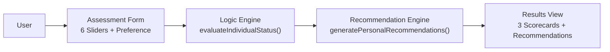
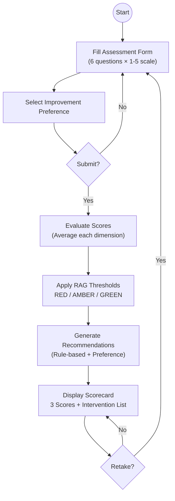

# Employee Tech-Balance Scorecard — System Diagram & Flowchart

**M.Sc. IS Research (IT6010) — SLIIT Computing Faculty**

---

## 1. System Architecture

```mermaid
graph LR
    U["User"] --> AF["Assessment Form\n6 Sliders + Preference"]
    AF --> IE["Logic Engine\nevaluateIndividualStatus()"]
    IE --> GR["Recommendation Engine\ngeneratePersonalRecommendations()"]
    GR --> RV["Results View\n3 Scorecards + Recommendations"]
```

---

## 2. Flowchart

```mermaid
flowchart TD
    S(("Start")) --> F["Fill Assessment Form\n(6 questions × 1-5 scale)"]
    F --> P["Select Improvement Preference"]
    P --> C{"Submit?"}
    C -->|No| F
    C -->|Yes| E["Evaluate Scores\n(Average each dimension)"]
    E --> T["Apply RAG Thresholds\nRED / AMBER / GREEN"]
    T --> R["Generate Recommendations\n(Rule-based + Preference)"]
    R --> D["Display Scorecard\n3 Scores + Intervention List"]
    D --> Q{"Retake?"}
    Q -->|Yes| F
    Q -->|No| D
```
